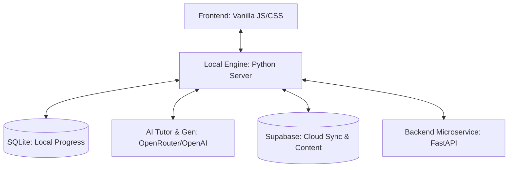

# Bright Study: Offline-First Learning Engine

Bright Study is a state-of-the-art educational platform designed to provide a premium, interactive learning experience that works seamlessly even in zero-bandwidth environments. It combines a local Python-based intelligence engine with a rich, modern web interface.

---

## 🏗️ Architecture Overview

The project is structured into three primary layers, ensuring a clear separation of concerns and high portability:



### 1. **Frontend (`/UI`)**
A lightweight, high-performance interface built with Vanilla JavaScript and CSS. It's optimized for low-end devices while maintaining a premium "glassmorphism" aesthetic.

### 2. **Local Intelligence Engine (`/engine`)**
The core "brain" of the application. It runs a local Python server (`web_ui.py`) that handles:
- **Pedagogical Logic**: Guided lesson flows and adaptive concept mastery.
- **Offline Content Delivery**: Serving local JSON/media content from `pune_content/`.
- **API Proxying**: Securely routing requests to cloud services (AI, Supabase) when online.

### 3. **Backend Microservice (`/backend`)**
A robust FastAPI application following **Clean Architecture** principles. It includes:
- **Domain Layer**: Core business entities and rules.
- **Persistence Layer**: Data access logic (initially SQLite/PostgreSQL).
- **API Layer**: RESTful endpoints for authentication, course management, and dashboards.
- **Auto-UI Serving**: Includes a fallback to serve the main frontend directly.

---

## 🌟 Key Features

### 🤖 AI Tutor & Chat
- **Context-Aware Assistance**: Learners can link the AI Tutor to specific lessons for relevant help.
- **Document Support**: Upload `.txt`, `.md`, or `.csv` files to chat with your own study materials.
- **OpenRouter Integration**: Leverage top-tier LLMs like GPT-3.5/4 while maintaining speed.

### 📅 Exam Study Planner
- **Interactive Wizard**: A step-by-step setup to capture subjects, dates, and study habits.
- **Smart Prioritization**: A client-side algorithm that automatically sorts subjects by exam proximity and user-defined priority.
- **Cloud Sync**: Saves generated schedules to the cloud so students can access them across devices.

### 🚀 Adaptive Learning
- **Mastery Tracking**: The engine tracks mastery levels for every concept using an adaptive scoring logic.
- **Dynamic Module Generation**: If a student is struggling, the AI generates a simplified "Beginner" version of the lesson on the fly.

### 📂 Course Builder
- **Scalable Content**: Teachers and admins can create full courses, subjects, and lessons directly through the UI.
- **JSON Export**: Content is saved in a structured JSON format, making it easy to share and version control.

---

## 📁 Project Structure

```text
Offline-learning-engine/
├── UI/                  # Responsive Frontend (index.html, main.js, styles.css)
├── engine/              # Local Engine (web_ui.py, ai_tutor.py, adaptive.py)
├── backend/             # FastAPI Microservice (Authentication, Admin API)
├── pune_content/        # Local Content Store (Lessons, Concepts, Assets)
├── database/            # Local SQLite storage (progress.db)
├── content/             # Legacy/Template content files
└── tests/               # Test suites for UI and Logic
```

---

## ⚙️ Setup & Installation

### **Prerequisites**
- Python 3.9+
- Node.js (for UI testing only, not required for runtime)

### **Step 1: Start the Local Engine**
The local engine is the primary gateway for the application.
```bash
cd engine
pip install requests  # Standard dependencies
python web_ui.py
```
*Access the app at: `http://localhost:8000`*

### **Step 2: Setup the Backend (Optional/Admin)**
Required for cloud authentication and advanced metrics.
```bash
cd backend
python -m venv .venv
source .venv/bin/activate  # or .venv\Scripts\activate on Windows
pip install -r requirements.txt
python -m uvicorn app.main:app --reload
```

---

## 🛠️ Integration Guide for Team Members

### **Adding New Content**
To add a new subject or lesson without using the UI:
1. Create a concept JSON in `pune_content/concepts/`.
2. Reference the concept ID in a lesson JSON in `pune_content/lessons/`.
3. The Local Engine will automatically pick up the new files on the next dashboard render.

### **Working with the AI Tutor**
- The AI parameters are configured in `engine/ai_tutor.py`.
- Ensure your `.env` file in the root contains a valid `OPENROUTER_API_KEY`.

### **Styling & UI**
- Maintain the design system defined in `styles.css` using the CSS variables in `:root`.
- All navigation logic should be centralized in the `app.showSection` method in `main.js`.

---

## 📜 Development Principles
1. **Low-Bandwidth First**: Minimal payloads, lazy-loading for videos.
2. **Vanilla Over Frameworks**: Keep the UI footprint under 1MB for instant loading.
3. **Data Security**: Local progress is prioritized; cloud sync is a secondary, encrypted layer.

---
*Built with ❤️ for educational excellence.*
